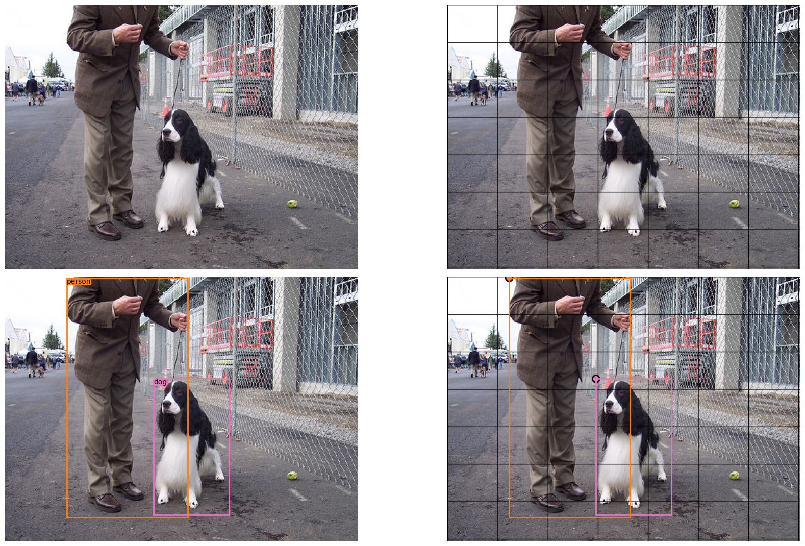
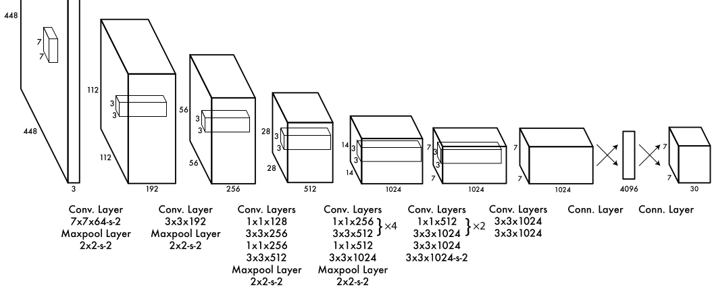
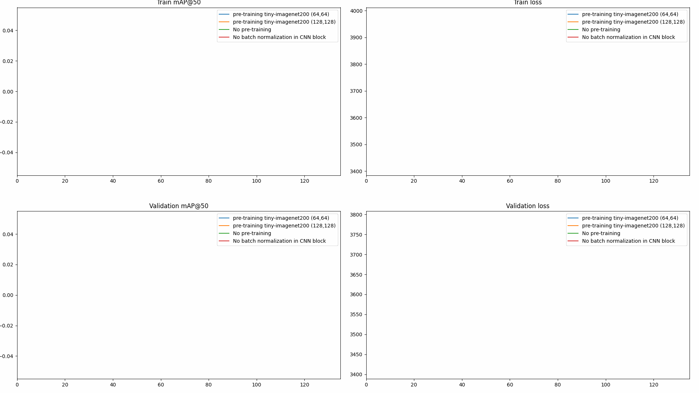
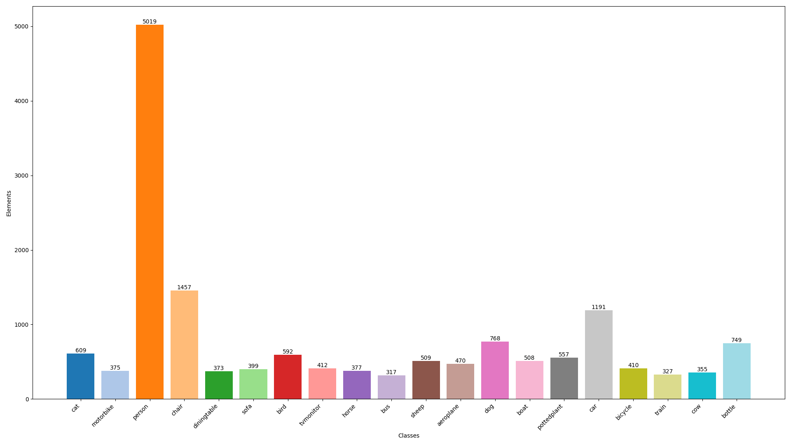
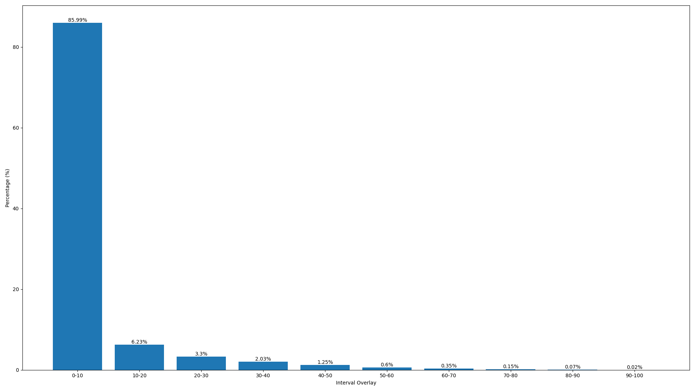

# **YOLOV1 Implementation on Pytorch**
**Y**ou **O**nly **L**ook **O**nce (**YOLOV1**) is an **object detection** model published in
the paper **<u><a href="https://arxiv.org/pdf/1506.02640">'You Only Look Once: Unified, Real-Time Object Detection'</a></u>** **(2015)**.
This model had a huge impact in the field, because at that time the most popular model
was R-CNN (Region-Based Convolutional Neural Network), its functioning is heavy because
it processes the same image several times (on average a hundred times). In this way, YOLOV1
was a response to this model.

## <u>**Model Functioning**</u>
### Model Implementation
The logic behind YOLO is to apply a grid to the image after convolutional and feed-forward
(Multilayer Perceptron (MLP)) operations. In the original paper a grid of size $7 \times 7$
is chosen, but depending on the user's needs, the grid size ($\mathbf{S_{H}}$, **$\mathbf{S_{W}}$**)
 $\mathbf{\in}$ $\mathbf{[|1;H|] \times [|1;W|]}$. It is worth noting that if ($\mathbf{S_{H}}$, 
**$\mathbf{S_{W}}$**) = ($\mathbf{H}$, $\mathbf{W}$), it is no longer classical object detection, but rather **Segmentation**. 
In the case where ($\mathbf{S_{H}}$, **$\mathbf{S_{W}}$**) $\neq$ ($\mathbf{H}$, $\mathbf{W}$) 
and considering a dataset that has $\mathbf{n}$ classes, objects can be predicted by the model with 
$\mathbf{(n+5)}$ values, $\mathbf{n}$ values to predict the category of the object, $\mathbf{1}$ 
value characterizing the model's confidence for the object and $\mathbf{4}$ geometric values with
representing a parallelogram, what we call a '**bounding box**'.

In this way, each cell of the grid predict $\mathbf{n+5}$ values, but YOLO creators decided to add
one more parameter to increase the model's prediction capacity. A cell can predict a unique
label but several bounding boxes, this parameters will be marked as $\mathbf{B}$. So, each cell predicts
$\mathbf{n + B \times 5}$. However, it's necessary to associate this objets to one cell only,
 by using the bounding box's center as illustrated in plot below, for the model learning but also to avoid the bounding boxes overlaying.
<tr>
	<td align="center">
	  <figure>
		
		<figcaption style="font-family: Arial, sans-serif;"><strong><u>YOLO Image Visualization</u></strong>: Top-left: Image. Top-right, grid applied. Bottom-left, objects identified by their bounding boxes. Bottom-right, fusion of precedent images with bounding boxes centers</figcaption>
	  </figure>
	</td>
</tr>

### **Non-Maximum Suppression**
The method used to avoid cells from predicting the same object and creating a superposition of
bounding boxes, is **Non-Max Suppression** (**NMS**). It consists of:
<ul>
<li>1. **Sort Predictions**: Decreasing sort of bounding boxes according to model confidence
by keeping only bounding boxes higher than a confidence threshold.
<li>2. **Best Selection**: Choosing the best predicted bouding box with the highest confidence (according the model) and considering it the best one.
<li> 3. **Bounding boxes deletion**: Browsing the remaining bounding boxes. Delete those
which have an Intersection Over Union (IoU) higher than an overlay threshold with the best one (or those which have the same
predicted label as the best one).
<li>4. Save the best one and repeat the method until the sorting is complete.
</ul>
<figure style="text-align: center;">
  
  
  <figcaption style="font-family: Arial, sans-serif; font-weight: bold;">
    <u>Before NMS &nbsp;&nbsp;|&nbsp;&nbsp; After NMS</u>
  </figcaption>
</figure>

### **Architecture**
YOLOV1 has an architecture called **Darknet** with several convolutional block as the
backbone (detailed can be seen in the drawing). Then, the model head is a MLP (feed-forward) with no activation function in the last layer. It is worth noting 
that the activation function for all layers, except the final one, is **Leaky ReLU** (Rectified Linear Unit) with 0.1
as the coefficient.

$$
\mathbf{LeakyReLU_{\alpha}: x \longmapsto \left\{
    \begin{array}{rcl}
       \alpha.x & \text{\ \ \ if \ } x < 0 \\
		x & \text{ \ \ \ otherwise}
        & 
    \end{array}\right.
}
$$

<tr>
	<td align="center">
	  <figure>
		
		<figcaption style="font-family: Arial, sans-serif; font-weight: bold;"><u>YOLOV1 Architecture: Darknet</u></figcaption>
	  </figure>
	</td>
</tr>

In the results, the model has been a slightly modified, convolutional block has one more
layer: **'Batch Normalization'**.

### **Loss Function**
The loss function is the main element for the model's learning, because its
gradient defines the learning direction during gradient descent. In this way,
the **YOLOV1** loss function is defined as:
$$
\mathbf{\lambda_{coord}\sum_{i=0}^{S_{H}\times S_{W}}\sum_{j=0}^{B}\mathbb{1}_{i,j}^{obj}((x_{i}-\hat{x_{i}})^{2}+(y_{i}-\hat{y_{i}})^{2}+(\sqrt{w_{i}}-\sqrt{\hat{w_{i}}})^{2}+(\sqrt{h_{i}}-\sqrt{\hat{h_{i}}})^{2})}
$$

$$
\mathbf{+\sum_{i=0}^{S_{H} \times S_{W}}\sum_{j=0}^{B}\mathbb{1}_{i,j}^{obj}(C_{i}-\hat{C_{i}})^{2} +\lambda_{noobj}\sum_{i=0}^{S_{H} \times S_{W}}\sum_{j=0}^{B}\mathbb{1}_{i,j}^{noobj}(C_{i}-\hat{C_{i}})^{2}}
$$

$$
\mathbf{+\sum_{i=0}^{S_{H} \times S_{W}}\mathbb{1}_{i}^{obj}\sum_{c \in classes}(p_{i}(c)-\hat{p_{i}}(c))^{2}}
$$

The loss function has two scalar parameters that can be called weights, $\mathbf{\lambda_{coord}}$
for bounding box values and $\mathbf{\lambda_{noobj}}$ for cells that predict object 
that do no belong to them. The first part is dedicated to the predicted bounding box values
where the indicator $\mathbf{\mathbb{1}_{i,j}^{obj}}$ denotes if the j-th bounding box predictor
in cell i is responsible for a prediction. The remainder of the function focuses on
confidence and class prediction where $\mathbf{\mathbb{1}_{i,j}^{noobj}}$ is the opposite
$\mathbf{\mathbb{1}_{i,j}^{obj}}$, and $\mathbf{\mathbb{1}_{i}^{obj}}$ denotes whether
the i-th cell is responsible for an object.

## <u>**Results on PASCALVOC2012**</u>
The model has been trained for 135 epochs both without and with pre-training (also with 
no batch normalization), for all experiments the hyperparamaters were fixed, NMS
had a confidence threshold of $\mathbf{0.5}$ and overlap threshold $\mathbf{0.3}$ 
(the reason for this is explained in the statistics section of the dataset). 
The dataset used is the same as in the original paper, **PASCALVOC2012**, detailed in 
the dedicated section.

<tr>
	<td align="center">
	  <figure>
		
		<figcaption style="font-family: Arial, sans-serif; font-weight: bold;"><u>YOLOV1 Experiments</u></figcaption>
	  </figure>
	</td>
</tr>

Despite pre-training with different sizes, all seem to converge around the same limit
according to the metric. Except for the experiment"No batch normalization in CNN block",
the model does not seem to be able to learn.

## <u>**Statistics on PascalVOC2012**</u>
This dataset has $\mathbf{20}$ classes with $\mathbf{5, 717}$ examples for the training set and $\mathbf{5, 823}$ for validation set.
It can be seen that the **person** class has a strong representation, which is not the best distribution
for a model like YOLOV1 to learn from, weights can be used to reduce the imbalance.

<tr>
	<td align="center">
	  <figure>
		
		<figcaption style="font-family: Arial, sans-serif; font-weight: bold;"><u>PASCALVOC2012 Distribution Class</u></figcaption>
	  </figure>
	</td>
</tr>

This chart allows to see the overlap distribution between bounding boxes in the same image, which
guides the choice in NMS (by choosing $\mathbf{0.3}$ for overlay threshold, approximatively $\mathbf{95\%}$ of
 bounding boxes  are not of concerned). However, this distribution can vary greatly according 
to the nature of the classes in the dataset, or even the context in whinch the objects are localized in space 
(image).
<tr>
	<td align="center">
	  <figure>
		
		<figcaption style="font-family: Arial, sans-serif; font-weight: bold;"><u>PASCALVOC2012 Distribution Bounding Boxes Overlay</u></figcaption>
	  </figure>
	</td>
</tr>

This is the main difficulty in classical Object Detection (with
bounding boxes), in the case of YOLO, cells have to be perfect, but in reality, that's not possible.
The real solution to this problem is to apply a grid whose number of cells is equal to 
the number of pixels, **segmentation**, but the downside of this solution is the output size which is very high
compared to predicting bounding boxes with small grids.

